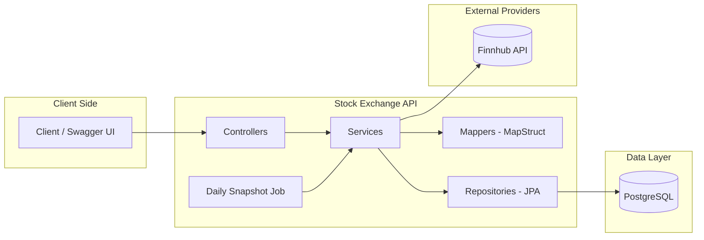
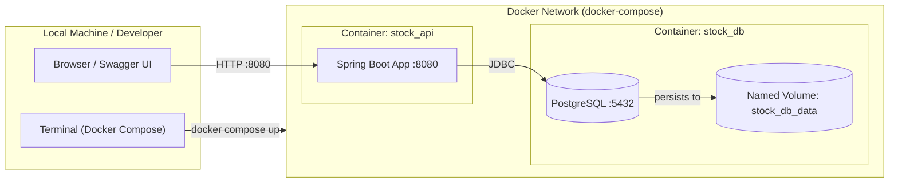

# 📈 Stock Exchange Market Companies API

Production-ready Spring Boot REST API for managing companies and retrieving real-time stock market data via external financial API integration.

This project demonstrates real-world backend engineering practices including clean architecture, external service integration, database persistence, automated testing, and maintainable code design.

---

# ⭐ Key Highlights

* Built production-style REST API using Spring Boot
* Integrated external financial API (Finnhub) using OpenFeign
* Designed layered architecture following clean code principles
* Implemented PostgreSQL persistence using Spring Data JPA
* Created unit and integration tests using Mockito, WireMock, and Testcontainers
* Used DTO pattern and MapStruct for clean data transfer
* Secured sensitive configuration using environment variables
* Documented and tested endpoints using Swagger

---

# 🚀 Features

* Create and manage companies
* Retrieve real-time stock prices
* Store daily stock snapshots
* RESTful API design
* PostgreSQL database integration
* Integrate external market data providers
* Persist and serve financial data

---

# 🏗 Architecture Overview

The application follows a layered architecture:
* Controller Layer - Handles HTTP requests and responses
* Service Layer - Contains business logic
* Repository Layer - Handles database communication
* External Client Layer - Handles communication with Finnhub API
* Mapper Layer - Maps between Entity and DTO

## 🧠 System Architecture



This structure ensures scalability, testability, and maintainability.

---

# 🛠 Tech Stack

Backend

* Java 25
* Spring Boot 4
* Spring Web
* Spring Data JPA
  
Database

* PostgreSQL
  
External Integration

* Finnhub API
* OpenFeign
  
Testing

* JUnit 5
* Mockito
* WireMock
* Testcontainers
  
Tools

* Gradle
* Lombok
* MapStruct
* Swagger / OpenAPI
* dotenv-java

---

# 🧪 Testing Strategy

This project includes production-style testing:

## Unit Testing

* Service layer isolation using Mockito

## Integration Testing

* External API mocking using WireMock
* Real database testing using Testcontainers

This ensures reliability and correctness of business logic and integrations.

---

# ⚙️ Setup Instructions

## 1. Clone repository

```
git clone https://github.com/danevairena/stock-exchange-market-companies
cd stock-exchange-market-companies
```

---

## 2. Create .env file

Copy:

```
.env.example
```

Create:

```
.env
```

Fill with your values:

```
DB_URL=jdbc:postgresql://localhost:5432/stockdb
DB_USERNAME=your_username
DB_PASSWORD=your_password
FINNHUB_API_KEY=your_api_key
FINNHUB_BASE_URL=https://finnhub.io/api/v1
```

---

## 3. Run application

```
./gradlew bootRun
```

Application runs on:

```
http://localhost:8080
```

---

# 📚 API Documentation

Swagger UI:

```
http://localhost:8080/swagger-ui.html
```

---

# 🔐 Security

Sensitive data is stored in `.env` and excluded from version control.

---

# 🐳 Docker Deployment Architecture

The application runs using Docker Compose with two containers:

* stock_api – Spring Boot application
* stock_db – PostgreSQL database



---

# 🧪 Example Endpoints

## Create Company

POST `/api/companies`

## Get All Companies

GET `/api/companies`

## Get Company Stock Data

GET `/api/stocks/{symbol}`

---

# 💼 Engineering Practices Demonstrated

This project demonstrates practical experience with:
* REST API design
* Spring Boot backend development
* External API integration
* Database persistence with JPA
* DTO and mapping patterns
* Integration testing
* Clean architecture
* Production-style project structure

---

# 👩‍💻 Author

Irena Daneva
GitHub: https://github.com/danevairena

---

# 📌 Project Purpose

This project is part of my backend developer portfolio and demonstrates hands-on experience with Java and Spring Boot backend development.
